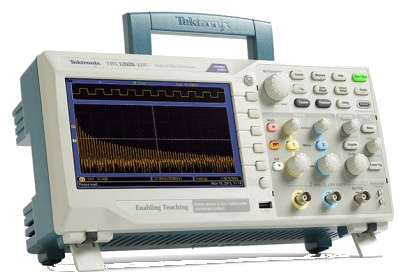
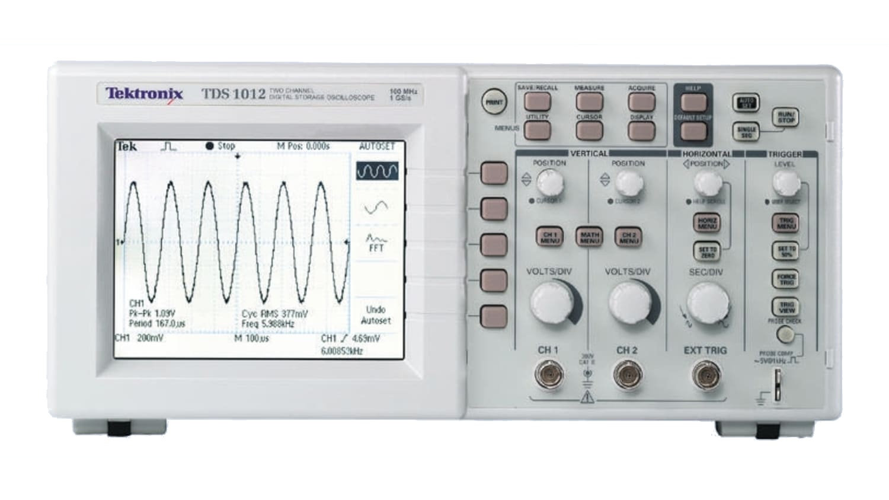
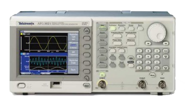
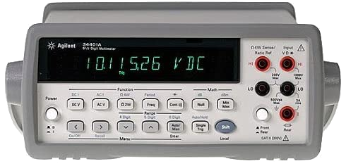
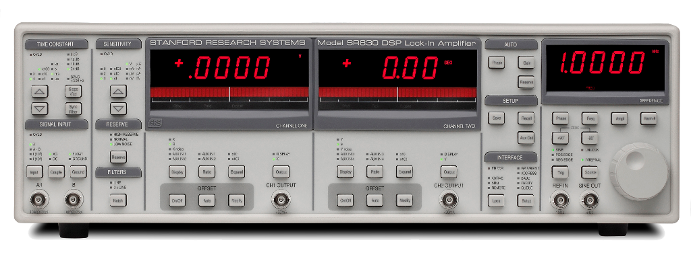
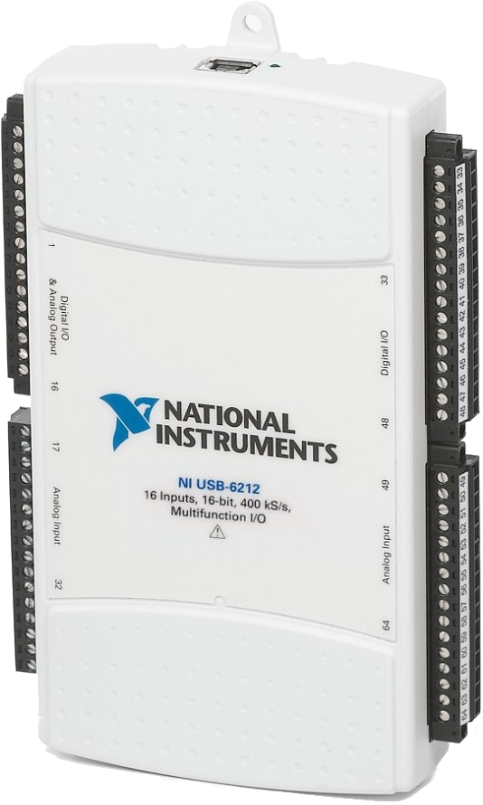

# Repositorio de scripts para instrumentación en Python

Aquí se publicará información y scripts de programación para controlar y adquirir datos de instrumentos de laboratorio. Es parte de material de trabajo de las materias de Laboratorio 4 y Laboratorio 5 del [Departamento de física de la UBA](https://www.df.uba.ar/es/docentes/paginas-de-materias/).

Parte del material fue tomado o modificado a partir de lo publicado por [Hernan Grecco](https://github.com/hgrecco/labosdf) y [Diego Shalom](https://github.com/diegoshalom/labosdf) en sus repositorios.
Para una introducción teórico-práctica al tema ver:

-------

<strong>
<a href="https://marceluda.github.io/python-para-fisicos/tuto/labo2/05_instrumentacion/"  >Introducción a Instrumentación para laboratorios de física</a>
</strong>

-------

## Instrumentos

Lista de instrumentos

### Tektronix TBS1052b y TDS1000b (Osciloscopio)

 

Página web:
  - [TDS1000b](https://www.tek.com/datasheet/tds1000b-series-digital-storage-oscilloscopes-datasheet)
  - [TBS1000](https://www.tek.com/oscilloscope/tbs1000-digital-storage-oscilloscope)

Manuales:
  - [Manual de programación de la web de Tektronix](https://download.tek.com/manual/TBS1000-B-EDU-TDS2000-B-C-TDS1000-B-C-EDU-TDS200-TPS2000-Programmer_EN-US-RevA.pdf)

Script de ejemplo:
  - [TektronixTDS1002B.py](TektronixTDS1002B.py)

### Tektronix AFG3000 ( Generador de funciones )

Página web:
  - [AFG3000](https://www.tek.com/datasheet/afg3000-series)
  - [AFG1000](https://www.tek.com/arbitrary-function-generator/afg1000-arbitrary-function-generator)

Manuales:
  - [Manual de programación AFG3000](https://download.tek.com/manual/AFG3000-Series-Arbitrary-Function-Generator-Programmer-EN.pdf)

Script de ejemplo:
- [TektronixAFG3021B.py](TektronixAFG3021B.py)

### Agilent/Keysight 34401 ( Multímetro de banco )

Página web:
  - [A34401](https://www.keysight.com/zz/en/product/34401A/digital-multimeter-6-digit.html)

Manuales:
  - [Manual de uso y programación A34401](https://www.keysight.com/zz/en/assets/9018-01063/user-manuals/9018-01063.pdf)

### Stanford SR830 ( Amplificador Lock-in )

Página web:
- [SR830](https://www.thinksrs.com/products/sr810830.htm)

Manuales:
- [Manual de uso y programación SR830](https://www.thinksrs.com/downloads/pdfs/manuals/SR830m.pdf)

### National Instruments USB-6212 ( DAQ: adquisición digital )

Página web:
- [NI-USB-6212](https://www.ni.com/es-cr/support/model.usb-6212.html)

Manuales:
- [Manual](https://www.ni.com/pdf/manuals/371931f.pdf)
