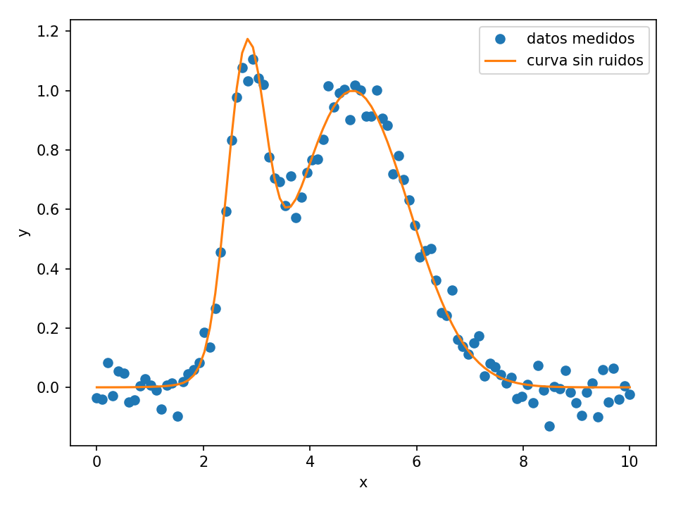



<div class="alert alert-danger" role="alert" >
  <strong>Aviso:</strong> La página está en construcción.
</div>

Los ejemplos de tratados aquí se pueden descargar de:
https://github.com/marceluda/python-para-fisicos/tree/master/tutoriales/analisis

Vamos a ver ejemplos de ajuste no lineal con diferentes funciones del paquete
de `scipy.optimize`.

## Armamos una serie de datos

El código a continuación tiene los `import` necesarios para usar las funciones
de ajuste no lineal. Generamos dos tiras de datos que simularán ser el resultado
de mediciones o relevamientos.

```python
# Generamos tiras de datos que simulan ser resultados de modiciones
# Pensamos en algún fenomeno que da como resultado de una medición dos
# campanas gaussianas superpuestas. La forma de esas campanas depende de
# 4 valores que fijamos de forma exacta para fabricarnos los datos
# Si el ajuste funciona bien, deberíamos recuperarlos luego.

# En el eje x, 100 valores equiespaciados entre 0 y 10
x_datos  = np.linspace(0, 10, 100)

# En el eje y, las gaussianas superpuestas, calculadas a partir de x
y_exacto = np.exp(-(x_datos-2.8)**2/0.5**2)+np.exp(-(x_datos-4.8)**2/1.5**2)

# Pare comparar despues
# Parametros en orden de aparición:
parametros_reales = [2.8, 0.5, 4.8, 1.5]

# Agregamos algo de "ruido" para darle realismo
np.random.seed(1729)

# Ruido con distribución normal escalado a 0.05
y_ruido = 0.05 * np.random.normal(size=x_datos.size)

# Agregamos el ruido para tener la serie de datso de y que simula ser
# el resultadod e un experimento
y_datos = y_exacto + y_ruido


# Esta es la comparación entre los valoers exatos del fenómeno que uno desea
# analizar y los que "logramos medir", con el ruido incluido.


plt.figure()
plt.plot(x_datos,  y_datos, 'o', label='datos medidos')
plt.plot(x_datos, y_exacto, '-', label='curva sin ruidos')
plt.legend(loc='best')
plt.xlabel('x')
plt.ylabel('y')
plt.tight_layout()
```



